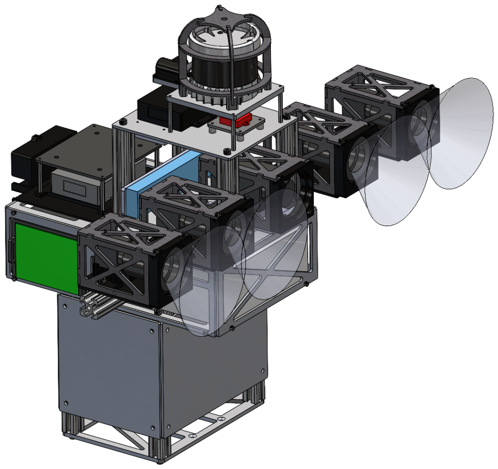
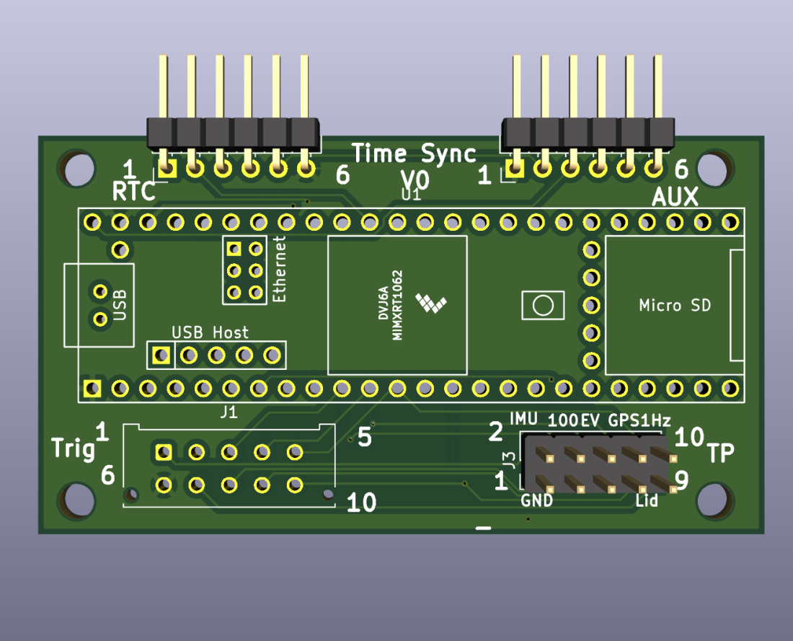

<!-- ======================= OctoSense ======================= -->
<p align="center">
  
</p>

<p align="center"><b>Self-Supervised Learning for Multimodal Robot Perception</b></p>

<p align="center">
  <a href="https://arxiv.org/abs/2606.27317"></a>
  <a href="https://huggingface.co/datasets/anthonytec2/OctoSense"></a>
  <a href="https://colab.research.google.com/drive/11hBm5dH--7HueAFCKtaAFnDAJul-52fb?usp=sharing"></a>
  <a href="LICENSE"></a>
</p>

<p align="center">
  <video src="https://github.com/user-attachments/assets/d7269059-0989-4554-a36d-4d6e72473253"
         autoplay loop muted playsinline controls width="100%">
    <a href="https://huggingface.co/datasets/anthonytec2/OctoSense/resolve/main/assets/hero.mp4">Watch the OctoSense overview video</a>
  </video>
</p>

---

**OctoSense** is a multimodal dataset spanning a car, boat, and quadruped on a shared sensor platform. The
bulk is large-scale **driving**: **59 hours / 2,474 km / 8.43 TB** of time-synchronized data from
**stereo RGB + event cameras, LiDAR, thermal, IMU, RTK-GPS, and the vehicle CAN bus**, recorded across
urban, suburban, and rural roads from sunrise to night and through degraded sensors, with
ground truth for **depth, optical flow, semantic segmentation, and ego-motion**. We also include
sequences recorded on a **boat** and a **Unitree quadruped** using the same sensor platform. Every sequence is
captured by a fully **open-source sensor platform** and processed with the pipeline in this repo.

> **Getting started with OctoSense data:** the
> [**getting-started notebook**](octosense_quickstart.ipynb) downloads a sequence and walks
> through every modality. Open it with **zero setup** in
> [Colab](https://colab.research.google.com/drive/11hBm5dH--7HueAFCKtaAFnDAJul-52fb?usp=sharing), or
> run it locally after the install below (activate the env first: `conda activate octosense`).
> 
> **The dataset (sensor specs, HDF5 schema, per-sequence metadata, and downloads) lives on the
> [Hugging Face dataset page](https://huggingface.co/datasets/anthonytec2/OctoSense).**
> This repository is the **tooling around it**: how the data is collected, visualized, and produced.


## Installation

OctoSense has two parts with separate environments:

- **Data acquisition + conversion**: the ROS 2 capture stack ([`OctoSense/`](OctoSense/)) and the
  raw-bag conversion run in a **custom-built Docker container** (ROS 2 Jazzy + source-built FFmpeg);
  only the raw-bag conversion in `data_processing/timesync/` needs the ROS 2 container. See
  **[OctoSense/README.md](OctoSense/README.md)** to build and run it.
- **Data loading + processing**: loading/visualizing the data, deriving flow, and the
  depth/segmentation ground-truth and semantic-search tooling run in the **conda env** below.

```bash
git clone https://github.com/anthonytec2/OctoSense.git
cd OctoSense
conda env create -f environment.yml      # installs Python, FFmpeg, and a CPU build of PyTorch
conda activate octosense
```

This installs a **CPU** build of PyTorch + torchcodec by default. On a **CUDA GPU** (faster video
decoding and model inference) reinstall the **GPU wheels** for torch, torchvision, and torchcodec
after activating, picking versions per the
[torchcodec compatibility table](https://github.com/meta-pytorch/torchcodec#compatibility-with-torch-versions):

```bash
pip install 'torch==2.12.*' 'torchvision==0.27.*' 'torchcodec>=0.14' \
  --index-url https://download.pytorch.org/whl/cu130
```


## Download the dataset

The full dataset (8+ TB) lives on the
[Hugging Face dataset page](https://huggingface.co/datasets/anthonytec2/OctoSense).
Use **`download_octosense.py`** (repo root) to grab a subset by platform, sequence, and modality,
and skip the raw event streams (`events.h5`, ~78% of each sequence's bytes):

```bash
pip install huggingface_hub

# all car sequences (everything)
python download_octosense.py --platform car --out ./octosense

# the same, but skip the raw event streams (events.h5, ~78% of the bytes)
python download_octosense.py --platform car --no-events

# one sequence, only the core LiDAR/IMU/GPS h5 + depth + segmentation
python download_octosense.py --sequence rosbag2_2026_01_04-13_51_24 --modalities data,depth,seg

# download_octosense.py just wraps huggingface_hub, so you can also use the HF CLI directly
hf download anthonytec2/OctoSense --repo-type dataset --local-dir ./octosense
```

`--modalities` picks from `data, events, captions, depth, seg, rgb, ir`.


Five entry points into OctoSense from this repository, start with the notebook:

### Start here: the quickstart notebook ([`octosense_quickstart.ipynb`](octosense_quickstart.ipynb))
The [getting-started notebook](octosense_quickstart.ipynb) downloads a sequence and walks
through every modality (LiDAR, stereo RGB, events, depth, segmentation, GPS, IMU, CAN, and captions).
Open it with **zero setup** in
[Colab](https://colab.research.google.com/drive/11hBm5dH--7HueAFCKtaAFnDAJul-52fb?usp=sharing), or run
it locally after the install above (activate the env first: `conda activate octosense`).

### Visualize a sequence ([`data_processing/viz/`](data_processing/viz/))

<p align="center">
  <video src="https://github.com/user-attachments/assets/0f6a7751-e6b5-42f4-a3f9-07839ff3b1ef"
         autoplay loop muted playsinline controls width="100%">
    Rerun viewer scrubbing an OctoSense sequence across every modality.
  </video>
</p>

Generate a **[Rerun](https://rerun.io)** recording from a downloaded sequence with the script below,
then open the resulting `.rrd` in the Rerun viewer to scrub every modality on one shared timeline
(LiDAR, stereo RGB, reconstructed event video, depth, GPS track, IMU, CAN signals, and captions) with
a bundled viewer layout:

```bash
python data_processing/viz/rerun_viz.py --dir <sequence_dir>
```

### Search the dataset in natural language ([`data_processing/sem_search/`](data_processing/sem_search/))

<p align="center">
  
</p>
<p align="center"><sub>The <code>serve</code> web UI: a natural-language query returning ranked clips with scores and scene captions.</sub></p>

Every 5s of image sensor data is captioned and embedded into a hybrid **FAISS + BM25** index, so you can find moments
across all 2,474 km by description ("a car turning left at dusk", "wet road at night", "pedestrian
crossing"). Download the prebuilt index from the dataset and query it from the CLI
(CPU works; a GPU just speeds up the query encoder):

```bash
# 1) prebuilt search index (~700 MB) from the dataset
hf download anthonytec2/OctoSense --repo-type dataset --include "semantic_search/*" --local-dir ./octosense

# 2) natural-language query -> ranked sequences + timestamps (run from data_processing/)
cd data_processing
python -m sem_search.main query "a car turning left at dusk" --index-dir ../octosense/semantic_search

# 3) or browse results in a web UI (matching video clips in the browser at http://localhost:8000)
#    set DATA_BASE_PATH so the UI can play each result's clip (see note below)
DATA_BASE_PATH=./octosense/car python -m sem_search.main serve --index-dir ../octosense/semantic_search --port 8000
```

First run pulls the **Qwen3-Embedding** query encoder. Searching needs no video, but to **play the
matching clips** in the web UI, set the **`DATA_BASE_PATH`** env var to the dataset root that holds
`<session>/<bag>/{img_left.mp4, data.h5}` (e.g. `./octosense/car`); the clip/thumbnail endpoints read
`img_left.mp4` from there per request. Results can come from any sequence, so a clip only plays if
that sequence's `img_left.mp4` is present under `DATA_BASE_PATH` (others return 404; the text results
still show). For how the index is built, see the
**[`sem_search` stage details](data_processing/README.md)**.

### Collect your own data ([`OctoSense/`](OctoSense/))
Everything to reproduce the sensor platform and record your own synchronized data: the ROS 2 (Jazzy) capture
stack, **hardware PPS time-sync** (Teensy firmware + KiCad SyncBoard distributing a
pulse-per-second to every sensor), the mechanical **CAD**, the containerized capture environment, and
a web monitor to watch per-sensor health and start/stop recording.
**[Build and run instructions](OctoSense/README.md)**

<table align="center">
  <tr>
    <td align="center"></td>
    <td align="center"></td>
  </tr>
  <tr>
    <td align="center"><sub>OctoSense Sensor Platform (CAD)</sub></td>
    <td align="center"><sub>Time Synchronization Custom PCB</sub></td>
  </tr>
</table>

### Process ROS2 Bags into OctoSense ([`data_processing/`](data_processing/))
The pipeline that turns a raw ROS 2 bag into the released sequences, as independent stages:
**`timesync`** (PPS clock-sync of all sensors to per-bag HDF5 + H.265 video), **`lidar_cal`**
(LiDAR/camera extrinsics), **`depth_gt`** (accumulated-LiDAR depth + derived ego-motion optical
flow), **`seg_gt`** (EoMT semantic labels), and **`sem_search`** (caption + embed to natural-language
search index). **[Per-stage details](data_processing/README.md)**


> This repo releases the **platform + data tooling only**. The multi-modal masked auto-encoder
> (**model, training, and dataloader code**) will be released at a later date.


## Citation
```bibtex
@misc{bisulco2026octosense,
  title        = {{OctoSense}: Self-Supervised Learning for Multimodal Robot Perception},
  author       = {Bisulco, Anthony and Wang, Jeremy and Daniilidis, Kostas and Balestriero, Randall and Chaudhari, Pratik},
  year         = {2026},
  howpublished = {Preprint},
}
```

## License
Released under the **[MIT License](LICENSE)**: free to use, modify, and redistribute with attribution;
provided "as is" without warranty. If you use OctoSense, please cite the paper above.
